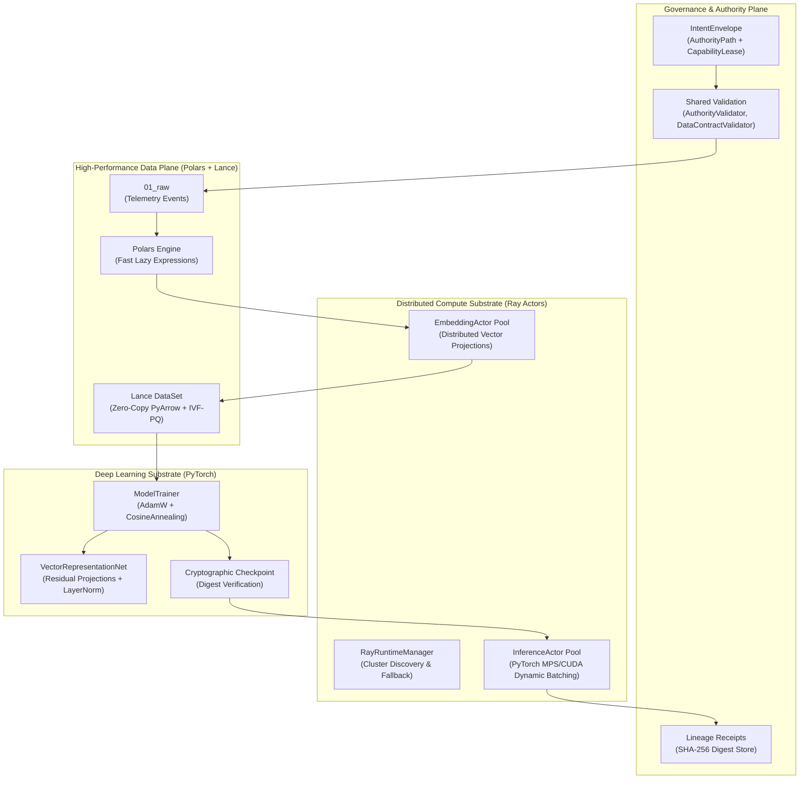

# CKODEX AIOps Platform: World-Class AI Architecture Template

[](https://www.python.org/)
[](https://astral.sh/uv)
[](https://kedro.org/)
[](https://www.ray.io/)
[](https://lancedb.com/)
[](https://pola.rs/)
[-EE4C2C.svg)](https://pytorch.org/)
[]()

Production-grade, high-assurance AI operations template built on the **CKODEX Constitutional Signature**:
> *Authority-Born. Intent-Native. Pure Semantic Kernel. Shared Validation. Vector State, Not Booleans. Proof Before Side Effects. Receipts After Execution. Day-2 by Default.*

---

## 1. Architecture Overview



---

## 2. Core Technology Stack

| Component | Role in Architecture | Key Implementation |
| :--- | :--- | :--- |
| **[UV](https://astral.sh/uv)** | Lightning-fast Python package & workspace manager | `pyproject.toml`, deterministic lockfile, sub-second installs |
| **[Kedro](https://kedro.org/)** | Pipeline orchestration & Data Catalog | Custom `LanceDataSet`, modular pipelines, lifecycle hooks |
| **[Ray & Ray Actors](https://www.ray.io/)** | Stateful distributed compute substrate | `EmbeddingActor`, `InferenceActor`, `ActorPoolManager` |
| **[Lance / LanceDB](https://lancedb.com/)** | Columnar vector database & storage format | Zero-copy PyArrow/Polars streaming, IVF-PQ indexing |
| **[Polars](https://pola.rs/)** | Ultra-fast data manipulation engine | Multi-threaded lazy query execution, window expressions |
| **[PyTorch](https://pytorch.org/)** | Deep neural network training & inference | `VectorRepresentationNet`, Apple Silicon MPS & CUDA acceleration |
| **CKODEX Kernel** | Pure deterministic domain semantics | $S(e,t) = \langle P, V, A, C, E, L, \tau \rangle$, Lineage Receipts |

---

## 3. Directory Structure

```text
ckodex-cfyd-aiops/
├── pyproject.toml               # UV configuration, dependencies, and tool settings
├── uv.lock                      # Deterministic locked dependency graph
├── Makefile                     # Standardized developer workflows
├── README.md                    # Platform architecture documentation
├── conf/                        # Kedro configuration environments
│   ├── base/
│   │   ├── catalog.yml          # Lance & Polars data catalog specifications
│   │   ├── parameters.yml       # Model, Ray, and pipeline hyperparameters
│   │   └── logging.yml          # Structured logging configuration
│   └── local/                   # Local environment overrides (gitignored)
├── data/                        # Tiered data storage
│   ├── 01_raw/                  # Ingested raw telemetry in Lance format
│   ├── 02_intermediate/         # Intermediate transformation buffers
│   ├── 04_feature/              # Vectors with IVF-PQ indices (features.lance)
│   ├── 06_models/               # Signed model checkpoints (model.pt)
│   ├── 07_model_output/         # Distributed inference predictions
│   └── 08_reporting/receipts/   # Immutable SHA-256 lineage receipts
├── src/ckodex_aiops/
│   ├── cli.py                   # Day-2 CLI (doctor, inspect, verify, benchmark, run)
│   ├── settings.py              # Kedro hooks registration & settings
│   ├── pipeline_registry.py     # Registry for modular & default pipelines
│   ├── kernel/                  # Pure Semantic Kernel (ZERO external heavy deps)
│   │   ├── intent.py            # IntentEnvelope, CapabilityLease, AuthorityPath
│   │   ├── state_vector.py      # StateVector S(e,t) product type & Conformance
│   │   ├── receipt.py           # LineageReceipt, EvidenceDigest, SHA-256
│   │   └── domain.py            # DatasetContract, ModelArtifactMetadata
│   ├── validation/              # Shared deterministic validation layer
│   │   ├── contracts.py         # Pydantic v2 schemas and validation outcomes
│   │   └── validators.py        # Authority, DataContract, and ModelIntegrity validators
│   ├── datasets/
│   │   └── lance_dataset.py     # Kedro Custom Dataset wrapper for Lance
│   ├── adapters/
│   │   ├── ray/
│   │   │   ├── runtime.py       # Resilient Ray cluster manager & health probes
│   │   │   └── actors/
│   │   │       ├── embedding_actor.py # Stateful Ray Actor for vector projections
│   │   │       ├── inference_actor.py # Stateful PyTorch model serving actor
│   │   │       └── pool.py            # ActorPoolManager for worker orchestration
│   │   └── lance/
│   │       └── store.py         # High-level LanceDB vector database adapter
│   ├── models/
│   │   ├── network.py           # VectorRepresentationNet PyTorch module
│   │   ├── dataset.py           # PolarsTorchDataset & LanceTorchDataset
│   │   └── trainer.py           # Hardware-accelerated ModelTrainer
│   ├── hooks/
│   │   ├── ray_lifecycle.py     # Hook managing Ray initialization/shutdown
│   │   └── evidence_hook.py     # Hook recording cryptographic lineage receipts
│   └── pipelines/
│       ├── data_ingestion/      # Synthetic telemetry generator & validation
│       ├── feature_engineering/ # Polars normalization + Ray Actor embeddings
│       ├── model_training/      # PyTorch training + cryptographic checkpointing
│       ├── model_evaluation/    # Conformance evaluation + StateVector reporting
│       └── inference/           # Distributed batch inference via Ray actors
└── tests/                       # Comprehensive unit and integration test suite
    ├── test_kernel.py           # Kernel invariants and StateVector tests
    ├── test_validation.py       # Authority and DataContract validation tests
    ├── test_lance_dataset.py    # LanceDataSet read/write/indexing tests
    ├── test_ray_actors.py       # Ray actor and pool execution tests
    ├── test_pytorch_models.py   # Neural net and trainer tests
    └── test_pipelines.py        # End-to-end Kedro pipeline tests
```

---

## 4. Getting Started

### Prerequisites
- Python 3.12+
- `uv` installed (`curl -LsSf https://astral.sh/uv/install.sh | sh` or `brew install uv`)

### Installation
```bash
# Clone repository and enter directory
cd ckodex-cfyd-aiops

# Install all dependencies with uv
uv sync
```

---

## 5. Day-2 Operations & CLI

The platform includes a built-in Typer + Rich CLI for operations:

### 1. Preflight Diagnostics (`doctor`)
Runs comprehensive health checks across hardware accelerators (Apple Silicon MPS / NVIDIA CUDA), Polars threading, Lance storage, Ray cluster resources, and disk storage:
```bash
uv run ckodex-aiops doctor
# or
make doctor
```

### 2. High-Throughput Micro-Benchmark (`benchmark`)
Benchmarks raw Polars vectorized transforms vs Lance zero-copy roundtrip vs Ray Actor pool dispatches:
```bash
uv run ckodex-aiops benchmark --num-samples 5000
# or
make benchmark
```

### 3. Pipeline Execution (`run`)
Runs the full Kedro pipeline with Ray hooks and evidence tracking:
```bash
uv run ckodex-aiops run --pipeline __default__
# or
make run-pipeline
```

Individual pipeline targets:
- `data_ingestion`: Ingests and admits raw telemetry into Lance format.
- `feature_engineering`: Polars window transforms + distributed Ray Actor embeddings.
- `training`: Trains PyTorch `VectorRepresentationNet` on Lance features.
- `evaluation`: Evaluates model against test sets and emits Conformance State Vector.
- `inference`: Distributed model inference served across Ray actors.

### 4. Physical AI & Multimodal Data Mining (`mine`)
Runs pushdown SQL queries combined with zero-copy Arrow retrieval over 100 Hz robotics sensor telemetry:
```bash
uv run ckodex-aiops mine --filter-expr "slip_detected = true" --limit 10
# or
make mine
```

### 5. Distributed Fragment Compaction (`compact`)
Executes distributed file compaction on Ray to eliminate small fragment fragmentation and maximize read IOPS:
```bash
uv run ckodex-aiops compact data/04_feature/physical_ai.lance
# or
make compact
```

### 6. Storage & Model Inspection (`inspect`)
Inspects Lance dataset row counts, schemas, vector indices, or PyTorch model checkpoints:
```bash
uv run ckodex-aiops inspect data/04_feature/physical_ai.lance
uv run ckodex-aiops inspect data/06_models/model.pt
```

### 7. Lineage & Evidence Audit (`verify`)
Audits and verifies cryptographic SHA-256 lineage receipts generated by pipeline nodes:
```bash
uv run ckodex-aiops verify
# or
make verify
```

---

## 6. Physical AI & Advanced Pretraining Architecture

Based on production engineering techniques from the Lance format and LanceDB research dossiers:

1. **Zero-Driver-OOM Single-Table Evolution**:
   - Rather than creating duplicate multi-terabyte tables for raw, deduplicated, and embedded robotics datasets, evolve a single table in-place using `LanceRayEngine.evolve_columns()`.
   - Distributes column addition across Ray workers without collecting data onto the driver node.

2. **3-Stage Asynchronous PyTorch Streaming (`StreamingLanceTorchDataset`)**:
   - Decouples storage I/O, CPU decompression, and GPU tensor transfers.
   - Leverages Lance's internal C++/Rust multithreaded readahead with zero-copy Arrow memory mapping.
   - Eliminates Python `DataLoader(num_workers > 1)` multiprocessing IPC overhead, memory copies, and cloud storage HTTP 429 throttling.
   - Provides DDP sharded fragment sampling (`ShardedFragmentSampler`) for multi-GPU training clusters.

3. **Multimodal Physical AI Event Mining**:
   - Ingests high-frequency (100 Hz) IMU linear acceleration, gyroscope angular velocities, and joint kinematics.
   - Employs Polars multi-threaded lazy expressions for windowed kinematic features (jerk magnitude, rolling acceleration variance, slip detection).
   - Combines pushdown SQL filters (`slip_detected = true`) with IVF-PQ cosine vector search on sensor embeddings for sub-second retrieval of robotics failure modes.

---

## 7. Testing & Quality Assurance

Run the complete test suite:
```bash
# Run pytest (23 tests covering kernel, Ray, Lance, PyTorch, Physical AI, and pipelines)
uv run pytest -v

# Run linting
uv run ruff check .

# Run code formatting check
uv run ruff format --check .
```

---

## 8. Constitutional Adherence

- **Pure Semantic Kernel (Rule #6)**: Pure domain logic in `src/ckodex_aiops/kernel/` is free of PyTorch, Ray, Lance, or Kedro imports.
- **State as a Vector, Not a Boolean (Rule #13)**: The system models reality with product types $\langle P, V, A, C, E, L, \tau \rangle$.
- **Proof Before, Receipt After (Rule #11)**: Every state mutation produces an immutable `LineageReceipt` stored under `data/08_reporting/receipts/`.
- **Zero-Trust Capability Leases (Rule #25)**: Execution requires an explicit `CapabilityLease` validated by `AuthorityValidator`.
- **Day-2 by Default (Rule #27)**: Complete operational visibility through `doctor`, `inspect`, `verify`, `benchmark`, `mine`, and `compact`.

