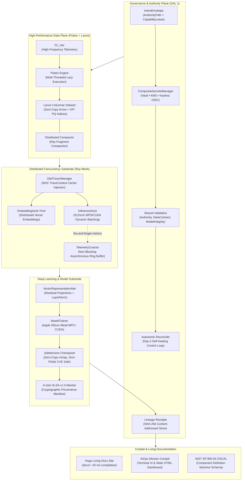

# CKODEX AIOps Platform: World-Class AI & DevSecOps Architecture

[](https://www.python.org/)
[](https://astral.sh/uv)
[](https://kedro.org/)
[](https://www.ray.io/)
[](https://lancedb.com/)
[](https://pola.rs/)
[](https://pytorch.org/)
[](https://dagger.io/)
[](https://gohugo.io/)
[]()

> **The CKODEX Signature:**  
> *Pure Kernel. Shared Validation. Explicit Transport. Evidence Everywhere. Vector State, Not Booleans. Proof Before Authority-Bearing Side Effects. Receipts After Execution. Day-2 by Default.*

---

## 1. System Topology & Architecture



---

## 2. Technology Matrix & Key Innovations

| Subsystem | Technology | Architectural Role & Innovations |
| :--- | :--- | :--- |
| **Package Management** | [UV](https://astral.sh/uv) | Sub-second deterministic dependency resolution via `pyproject.toml` and `uv.lock`. |
| **Pipeline Orchestration** | [Kedro 0.19+](https://kedro.org/) | Modular DAG orchestration, custom `LanceDataSet`, lifecycle hooks, and runtime catalog. |
| **Columnar Vector Storage** | [Lance](https://lancedb.com/) | Zero-copy PyArrow streaming, secondary IVF-PQ vector indexing, SQL pushdown filtering, and distributed fragment compaction. |
| **ETL Engine** | [Polars](https://pola.rs/) | Vectorized multi-threaded lazy query execution without Python GIL bottlenecks. |
| **Deep Learning & Accel** | [PyTorch](https://pytorch.org/) + [Safetensors](https://github.com/huggingface/safetensors) | Zero-pickle `mmap` tensor checkpoints on **Apple Silicon Metal (MPS)** and NVIDIA CUDA. |
| **Actor & Co-Actor Concurrency** | [Ray Core](https://www.ray.io/) | Compute-heavy `InferenceActor` decoupled from companion `TelemetryCoactor` ring buffers. |
| **SSDLC CI/CD Engine** | [Dagger](https://dagger.io/) | Containerized local/CI pipeline: Ruff lint, Pytest, Syft SBOM, Grype CVE gating, Gitleaks, and multi-arch OCI image builds (`linux/amd64`, `linux/arm64`). |
| **Living Documentation** | [Hugo Extended](https://gohugo.io/) | 17-page dark-themed architecture, DevSecOps, and Day-2 operations documentation site built in **23 ms**. |
| **Zero-Trust Secrets** | HashiCorp Vault • KMS • Keyless | Memory-safe `SecretValue` (redacted in `repr`/`str`), time-bounded `SecretLease`, and ambient OIDC workload identity. |
| **Distributed Tracing** | [OpenTelemetry](https://opentelemetry.io/) | W3C `traceparent` carrier injection/extraction across Ray RPC and Kedro node boundaries. |
| **Day-2 Autonomic Control** | CKODEX Reconciler | Canonical loop: `OBSERVE -> DETECT -> DIAGNOSE -> RECOVER -> RECONCILE`. Automatically heals fragmentation and drift. |
| **Supply-Chain Attestation** | In-toto + SLSA + OSCAL | SLSA v1.0 provenance statements and NIST SP 800-53 Rev 5 OSCAL component definitions. |
| **Governance & Lifecycle** | Pure Semantic Kernel | Self-documenting on/offboarding engine: authority hierarchy, bounded `CapabilityLease` issuance/revocation, cryptographic lineage receipts, and automated Hugo docs. |

---

## 3. Directory Layout

```text
ckodex-cfyd-aiops/
├── pyproject.toml               # UV configuration, dependencies, tools
├── uv.lock                      # Deterministic lockfile
├── justfile                     # Modern, self-documenting command runner
├── Makefile                     # Standardized developer workflows
├── README.md                    # Platform architecture dossier
├── .github/workflows/ssdlc.yml  # GitHub Actions harness delegating to Dagger
├── ci/                          # Dagger SSDLC Python Module
│   ├── dagger.json              # Dagger module manifest
│   └── src/ckodex_cicd/main.py  # Lint, test, Syft SBOM, Grype gate, Gitleaks, multi-arch OCI
├── deploy/                      # Multi-Cloud & Local Deployment Substrate
│   ├── compose/
│   │   ├── docker-compose.yml   # Ray Mesh, MLflow, Vault, Gateway, Docs Cockpit
│   │   └── Dockerfile.gateway   # Model Serving Gateway container
│   ├── helmfile.yaml            # Declarative multi-environment GitOps specification
│   └── charts/ckodex-aiops/     # Hardened Zero-Trust Helm chart (NetworkPolicy, Seccomp)
├── docs/                        # Hugo Extended Living Documentation Site
│   ├── hugo.toml                # Hugo configuration
│   ├── content/                 # Living architectural & DevSecOps content
│   └── static/cockpit.html      # Exported zero-dependency HTML mission cockpit
├── conf/                        # Kedro configuration environments
│   └── base/                    # catalog.yml, parameters.yml, logging.yml
├── data/                        # Content-addressed tiered data lakehouse
│   ├── 01_raw/                  # Ingested raw telemetry in Lance format
│   ├── 04_feature/              # Normalized features & IVF-PQ indices
│   ├── 06_models/               # Safetensors model checkpoints (model.safetensors)
│   ├── 07_model_output/         # Distributed inference predictions
│   └── 08_reporting/            # Receipts, attestations, OSCAL, SBOMs, Lifecycle
├── src/ckodex_aiops/
│   ├── cli.py                   # Day-2 CLI (doctor, reconcile, attest, cockpit, sbom, onboard, offboard)
│   ├── kernel/                  # Pure Semantic Kernel (ZERO external heavy dependencies)
│   │   ├── state_vector.py      # StateVector S(e,t) product type & ConformanceTransition
│   │   ├── reconciler.py        # Autonomic Day-2 Reconciler & Self-Healing Loop
│   │   ├── conformance.py       # Multi-Dimensional Conformance Vector Engine
│   │   ├── lifecycle.py         # Self-Documenting Subject Lifecycle Engine (On/Offboarding)
│   │   ├── profiles.py          # Platform Profiles & Baselines (Rule #36)
│   │   ├── receipt.py           # LineageReceipt & SHA-256 evidence digests
│   │   ├── intent.py            # IntentEnvelope & CapabilityLease
│   │   └── domain.py            # Pure domain entities
│   ├── adapters/
│   │   ├── compliance/          # In-toto SLSA, NIST OSCAL, CycloneDX/SPDX SBOM
│   │   ├── observability/       # OpenTelemetry OTEL manager & Mission Cockpit
│   │   ├── secrets/             # Zero-Trust Vault, KMS/Keyring, Keyless OIDC
│   │   ├── tracking/            # Flight Recorder & MLflow experiment tracking
│   │   ├── ray/                 # Ray runtime, lance-ray engine, Actor & Co-Actor mesh
│   │   └── lance/               # Columnar vector store adapter
│   ├── models/                  # PyTorch Safetensors network & streaming datasets
│   └── pipelines/               # Kedro pipeline modules (ingestion, features, train, eval, inference, physical_ai)
└── tests/                       # 63 Comprehensive Unit & Conformance Test Suites
```

---

## 4. Getting Started & Developer Workflows

### Prerequisites
- Python 3.12+
- `uv` package manager (`curl -LsSf https://astral.sh/uv/install.sh | sh` or `brew install uv`)
- `hugo` extended (`brew install hugo`)
- `dagger` CLI (`curl -fsSL https://dl.dagger.io/dagger/install.sh | sh` or `brew install dagger/tap/dagger`)

### Quickstart
```bash
# 1. Sync locked virtual environment
make install

# 2. Run platform preflight diagnostics
make doctor

# 3. Execute full Kedro end-to-end pipeline
make run-pipeline

# 4. Run full test suite (46 tests)
make test
```

---

## 5. Day-2 Operations & CLI Reference

The platform includes a built-in Typer + Rich CLI:

```bash
# Preflight health check across Apple Silicon Metal (MPS), Ray, Lance, and Secrets
uv run ckodex-aiops doctor

# Autonomic Day-2 Reconciler: Detects drift and auto-heals storage/models
uv run ckodex-aiops reconcile --auto-heal

# Statistical Feature & Sensor Drift Detection (Wasserstein distance)
uv run ckodex-aiops drift

# Multi-Dimensional Conformance Suite: Structural, Anti-Dominance, Degradation
uv run ckodex-aiops conformance

# Dynamic Model Quantization (Int8 post-training quantization with fidelity check)
uv run ckodex-aiops quantize --source data/06_models/model.safetensors

# Zero-Copy Model Serving HTTP Gateway with adaptive dynamic batching
uv run ckodex-aiops serve --port 8080

# Air-Gap Package Creation and Offline Verification
uv run ckodex-aiops airgap-pack
uv run ckodex-aiops airgap-verify

# Interactive AIOps Mission Cockpit (Terminal UI + HTML export)
uv run ckodex-aiops cockpit --export-html docs/static/cockpit.html

# Mint cryptographic In-toto SLSA v1.0 Provenance statement
uv run ckodex-aiops attest --subject data/06_models/model.safetensors

# Export NIST SP 800-53 Rev 5 OSCAL Component Definition
uv run ckodex-aiops oscal --out data/08_reporting/oscal/component_definition.json

# Inspect Safetensors checkpoint headers, tensor shapes, and digests
uv run ckodex-aiops inspect data/06_models/model.safetensors

# List platform profiles and promoted baselines
uv run ckodex-aiops profile list

# Mine Physical AI multimodal robotics telemetry with pushdown SQL
uv run ckodex-aiops mine --filter-expr "slip_detected = true" --limit 10

# Execute distributed fragment compaction on Lance datasets
uv run ckodex-aiops compact data/04_feature/physical_ai.lance

# Package template as an OCI Image Layout v1.1.0 artifact
uv run ckodex-aiops oci pack --version 1.0.0 --tag latest

# Inspect local OCI layout manifest, config, and typed layer digests
uv run ckodex-aiops oci inspect dist/oci-template

# Generate ORAS and Cosign commands for enterprise registry distribution
uv run ckodex-aiops oci guide --image ghcr.io/org/repo:1.0.0

# Audit cryptographic SHA-256 lineage receipts
uv run ckodex-aiops verify

# Day-2 Deep Observability: explain incident, receipt, or artifact (Rule #37)
uv run ckodex-aiops explain data/06_models/model.safetensors

# Day-2 Four Truth Channels: correlate telemetry, execution, decision, and evidence (Rule #12)
uv run ckodex-aiops trace rcpt_01519ee75d6b

# Designed Recovery & Checkpoint Integrity Verification (Rule #33)
uv run ckodex-aiops recover --checkpoint ckpt_1f4c98563c65

# Governed Replay under capability lease and side-effect fencing (Rule #34)
uv run ckodex-aiops replay --receipt rcpt_01519ee75d6b --dry-run

# Quarantine suspect artifact or subject and preserve evidence (Rule #32)
uv run ckodex-aiops quarantine isolate data/06_models/model.safetensors -a "Triage investigation"
uv run ckodex-aiops quarantine list

# Manage explicit time-bounded risk derogations (Rule #23)
uv run ckodex-aiops derogation list
```

---

## 6. DevSecOps, Dagger SSDLC & Diátaxis Living Documentation

All CI/CD automation runs in hermetic, containerized Dagger sandboxes with thin GitHub Actions dispatching:

```bash
# Execute complete SSDLC pipeline in parallel DAG
just dagger-ci

# Or run individual stages
just dagger-lint
just dagger-test

# Build and preview living Hugo documentation site (Diátaxis Framework)
just docs-build
just docs-serve

# Build documentation for GitHub Pages deployment via Dagger
just docs-pages-build
```

---

## 7. Verification Evidence & Quality Assurance

The test suite enforces constitutional invariants across 81 tests:

```text
======================== 81 passed in 55.10s (0:00:55) =========================
✓ tests/test_airgap.py: PASS (Air-gap packaging, manifest hashing, tamper detection)
✓ tests/test_coactor.py: PASS (Actor & Co-Actor asynchronous telemetry buffering)
✓ tests/test_compliance.py: PASS (In-toto SLSA v1.0 provenance & NIST OSCAL)
✓ tests/test_conformance.py: PASS (Structural, Anti-Dominance, Degradation contracts)
✓ tests/test_degradation.py: PASS (Degraded mode contracts, safe hold, capability fencing)
✓ tests/test_derogation.py: PASS (Explicit accepted risk derogations & compensating controls)
✓ tests/test_drift.py: PASS (Statistical Wasserstein distance & PSI drift detection)
✓ tests/test_explanation.py: PASS (Deep observability 11-question explanation engine)
✓ tests/test_kernel.py: PASS (State vector algebra, anti-dominance, SHA-256 receipts)
✓ tests/test_lance_dataset.py: PASS (Zero-copy Lance scanning, pushdown filters)
✓ tests/test_lance_ray.py: PASS (Ray Data ↔ Lance zero-copy streaming & compaction)
✓ tests/test_lifecycle.py: PASS (Self-documenting on/offboarding, lease revocation, receipts)
✓ tests/test_oci.py: PASS (OCI Image Layout v1.1.0 packaging, ORAS/Cosign distribution)
✓ tests/test_otel.py: PASS (OTEL tracer lifecycle & W3C TraceContext propagation)
✓ tests/test_physical_ai.py: PASS (100 Hz sensor streams, window slicing, IVF-PQ)
✓ tests/test_pipelines.py: PASS (Kedro end-to-end DAG execution & node resolution)
✓ tests/test_profiles.py: PASS (Profile registry, baseline promotion, drift detection)
✓ tests/test_pytorch_models.py: PASS (Classifier forward pass, streaming DataLoader)
✓ tests/test_quantization.py: PASS (Int8 quantization, compression & cosine fidelity)
✓ tests/test_quarantine.py: PASS (Quarantine isolation, vault storage, evidence preservation)
✓ tests/test_ray_actors.py: PASS (Ray embedding/inference actors & actor pool)
✓ tests/test_ray_advanced.py: PASS (Placement groups, zero-copy Plasma dispatch, full optimize)
✓ tests/test_reconciler.py: PASS (Autonomic Day-2 Reconciler loop & self-healing)
✓ tests/test_recovery.py: PASS (Designed checkpoint recovery & governed execution replay)
✓ tests/test_sbom.py: PASS (CycloneDX v1.5 and SPDX 2.3 JSON SBOM generation)
✓ tests/test_secrets.py: PASS (Redacted SecretValue, SecretLease, Vault, KMS, Keyless)
✓ tests/test_serving.py: PASS (Model serving gateway, /healthz, /livez, /infer)
✓ tests/test_trace.py: PASS (Four truth channels cross-channel correlator & coherence)
✓ tests/test_tracking.py: PASS (Flight Recorder & MLflow experiment tracking)
✓ tests/test_validation.py: PASS (Shared validation contracts & preflight bounds)

Ruff Linter & Formatter: 100% clean across 161 files (0 errors, 0 warnings).
Hugo Living Documentation: 53 pages built in 29 ms across 4 Diátaxis quadrants (0 errors, 0 warnings).
Platform Doctor: PASS (All hardware, compute, storage, and secrets subsystems healthy).
```

---

## 8. Constitutional Adherence (GAL 1)

1. **Pure Semantic Kernel (Rule #6)**: Pure domain logic in `src/ckodex_aiops/kernel/` has zero framework leakage.
2. **Vector State, Not Booleans (Rule #13)**: Governed reality is modeled as $S(e,t) = \langle P, V, A, C, E, L, \tau \rangle$. Anti-invariant violations dominate scores.
3. **Proof Before, Receipt After (Rule #11)**: Every state mutation produces an immutable `LineageReceipt` stored under `data/08_reporting/receipts/`.
4. **Zero-Trust Capability Leases (Rule #25)**: Execution requires explicit, time-bounded `CapabilityLease` instances.
5. **Day-2 Autonomic Control Loop (Rule #28 & #35)**: Reconciliation continuously converges observed state back to the active baseline profile.
6. **Supply-Chain Attestation (Rule #39)**: All artifacts are content-addressed and attested via In-toto SLSA v1.0 and NIST SP 800-53 OSCAL.
