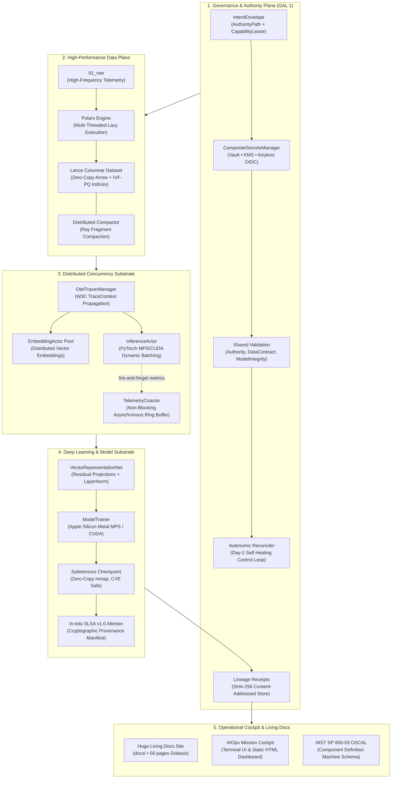

<p align="center">
  <picture>
    <source media="(prefers-color-scheme: dark)" srcset="https://shieldcn.dev/header/graph.svg?title=ckx-ai-project-template&subtitle=High-Assurance+AI+Platform+%26+Day-2+Operational+Substrate&theme=zinc&align=center&mode=dark" />
    
  </picture>
</p>

<p align="center">
  <strong>Constitutional, zero-trust AI operations template engineered for high-consequence machine learning, scientific discovery, and automated Day-2 operations.</strong>
</p>

<p align="center">
  <a href="https://github.com/ckodex-labs/ckodex-ai-project-template/stargazers"></a>
  <a href="https://github.com/ckodex-labs/ckodex-ai-project-template/blob/main/LICENSE"></a>
  <a href="https://github.com/ckodex-labs/ckodex-ai-project-template/actions/workflows/ci.yml"></a>
  
  <a href="https://www.python.org/"></a>
  <a href="https://astral.sh/uv"></a>
  <a href="https://dagger.io/"></a>
  
</p>

<p align="center">
  <a href="#quickstart">Quickstart</a> •
  <a href="#system-architecture">Architecture</a> •
  <a href="#core-capabilities">Capabilities</a> •
  <a href="#technology-stack">Tech Stack</a> •
  <a href="#day-2-cli-reference">CLI Reference</a> •
  <a href="#verification--quality">Verification</a> •
  <a href="https://ckodex-labs.github.io/ckodex-ai-project-template/">Documentation</a>
</p>

---

> **The CKODEX Architectural Signature:**  
> *Pure Kernel. Shared Validation. Explicit Transport. Evidence Everywhere. Vector State, Not Booleans. Proof Before Authority-Bearing Side Effects. Receipts After Execution. Day-2 by Default.*

---

## At a Glance

Most AI repositories collapse governance, data movement, compute orchestration, and business logic into brittle scripts. **`ckx-ai-project-template`** provides an enterprise-ready template built around **formal state vectors**, **cryptographic receipts**, and **hermetic execution**:

- **Autonomic Day-2 Reconciler**: Self-healing control loop (`OBSERVE -> DETECT -> DIAGNOSE -> DEGRADE -> CONTAIN -> RECOVER -> VERIFY -> RECONCILE`) that heals storage fragmentation and drift.
- **Pure Semantic Kernel**: Core governance and state invariants have **zero third-party dependencies** (no PyTorch, Ray, or Cloud SDK imports in kernel logic).
- **High-Performance Data Plane**: Columnar vector storage with [Lance](https://lancedb.com/) & PyArrow, multi-threaded lazy execution via [Polars](https://pola.rs/), and distributed processing on [Ray](https://www.ray.io/).
- **Zero-Pickle Safe Deep Learning**: PyTorch models persisted exclusively via [Safetensors](https://github.com/huggingface/safetensors) with memory-mapped zero-copy deserialization on Apple Silicon Metal (MPS) and NVIDIA CUDA.
- **Living Mission Cockpit**: Dual-theme (Paper Ledger & Deep Vault) interactive operational cockpit with SVG Merkle lineage graph, Hexagonal Radar, and real-time evidence margins.
- **Scientific SDK**: Governed scientific computing with `@governed_scientific` decorator, zero-copy FASTA/PDB connectors, and cryptographically verified asset offboarding.

---

## Quickstart

Get up and running in less than a minute.

### 1. Prerequisites

- **Python 3.12+**
- **uv** (`curl -LsSf https://astral.sh/uv/install.sh | sh` or `brew install uv`)
- **just** (`brew install just`)
- *(Optional for living docs)*: **hugo extended** (`brew install hugo`)
- *(Optional for hermetic SSDLC)*: **dagger** (`brew install dagger/tap/dagger`)

### 2. Setup & Execution

```bash
# Clone the repository
git clone https://github.com/ckodex-labs/ckodex-ai-project-template.git
cd ckodex-ai-project-template

# Install and sync deterministic virtual environment
just install

# Run the 7-Act High-Assurance Architectural Tour (~8 seconds)
just tour

# Launch the interactive Living Mission Cockpit
just cockpit-serve
# Browse to http://127.0.0.1:8888 for real-time Merkle lineage, radar metrics & logs
```

### 3. Verification

```bash
# Run full unit and conformance test suite (128 tests passing)
just test

# Validate code formatting, linting, and static types
just lint
just typecheck
```

---

## System Architecture

The platform separates architectural layers (dependency direction) from operational planes (cross-cutting governance):



---

## Core Capabilities

<details open>
<summary><strong>1. Day-2 Autonomic Control Loop & Self-Healing</strong></summary>

The autonomic reconciler converges observed reality back to target baselines without manual operator intervention:
- **Continuous Detection**: Monitors fragment sprawl, schema divergence, and statistical feature drift (using Wasserstein distance and Population Stability Index).
- **Compaction & Re-indexing**: Automatically executes Ray-backed fragment compactions on Lance datasets when threshold limits are breached.
- **Safe Hold & Quarantine**: Suspect artifacts are immediately isolated into cryptographic quarantine vaults, freezing egress while preserving all digital evidence for forensic triage.
</details>

<details>
<summary><strong>2. Pure Semantic Kernel & State Vectors</strong></summary>

Governed reality is represented not as binary booleans, but as a rich product type:
$$S(e,t) = \langle P, V, A, C, E, L, \tau \rangle$$
Where:
- **$P$ (Presence)**: Distinguishes between `EMPTY`, `PRESENT`, `UNKNOWN`, and `REDACTED` (absence of evidence is not negative evidence).
- **$V$ (Valence)**: Directional support (`POSITIVE`, `NEGATIVE`, `NEUTRAL`, `MIXED`).
- **$A$ (Anti-Invariant)**: Structural contradiction. **Hard anti-invariants dominate aggregate scores**—contradictions can never be averaged away.
- **$C$ (Coherence)**: Divergence between admitted vs runtime representations.
- **$E$ (Evidence)**: Verification status (`OBSERVED`, `VERIFIED`, `INFERRED`, `UNKNOWN`).
- **$L$ (Lifecycle)**: Current operational lifecycle stage.
- **$\tau$ (Epoch)**: Temporal position for replay and time-travel reconstruction.
</details>

<details>
<summary><strong>3. Zero-Trust Authority, Proof Before & Receipt After</strong></summary>

- **Explicit Authority Delegation**: `IntentEnvelope -> AuthorityPath -> CapabilityLease -> Execution -> LineageReceipt`.
- **Pre-execution Proof**: Verification of identity, lease delegation, and preflight bounds before side effects occur.
- **Post-execution Receipts**: SHA-256 content-addressable lineage receipts recorded to a Merkle chain for complete auditability.
- **Redacted In-Memory Secrets**: Memory-safe `SecretValue` containers that prevent accidental credential leakage in logs, stack traces, and representations.
</details>

<details>
<summary><strong>4. Scientific SDK for Governed Research</strong></summary>

- **Zero-Ceremony Decorator**: Wrap research kernels with `@governed_scientific` to automatically acquire capability leases, mint SHA-256 receipts, and inject telemetry.
- **Bioinformatics Connectors**: Native zero-copy FASTA and Protein Data Bank (PDB) loaders streaming directly into PyArrow tables.
- **Asset Tombstoning**: Cryptographic revocation and asset deprecation workflows that prevent deprecated models or contaminated datasets from entering production pipelines.
</details>

---

## Technology Stack

| Layer | Technology | Architectural Role |
| :--- | :--- | :--- |
| **Package Management** | [UV](https://astral.sh/uv) | Deterministic sub-second dependency locking via `pyproject.toml` and `uv.lock`. |
| **Pipeline DAG** | [Kedro 0.19+](https://kedro.org/) | Modular pipeline definitions, custom dataset catalogs, and lifecycle hooks. |
| **Columnar Storage** | [Lance](https://lancedb.com/) | Zero-copy vector store with IVF-PQ indices and secondary SQL pushdown. |
| **Data Engine** | [Polars](https://pola.rs/) | Vectorized multi-threaded lazy dataframe transformations. |
| **Deep Learning** | [PyTorch](https://pytorch.org/) + [Safetensors](https://github.com/huggingface/safetensors) | Zero-pickle tensor storage optimized for Apple Silicon (Metal MPS) and CUDA. |
| **Distributed Mesh** | [Ray Core](https://www.ray.io/) | Concurrency substrate decoupling heavy `InferenceActor` from `TelemetryCoactor`. |
| **DevSecOps** | [Dagger](https://dagger.io/) | Hermetic, containerized SSDLC pipeline: lint, test, SBOM, CVE gating, OCI packaging. |
| **Living Documentation** | [Hugo Extended](https://gohugo.io/) | 56-page Diátaxis-structured architecture site compiling in under 50 ms. |
| **Badge Engine** | [shieldcn-zig](https://github.com/MChorfa/shieldcn-zig) | Clean-room pure-Zig SVG badges adhering to WCAG 3.0 APCA contrast standards. |

---

## Day-2 CLI Reference

The platform provides a comprehensive operational CLI available via `ckx` or `uv run ckodex-aiops`:

```bash
# === Guided Tour & Preflight Diagnostics ===
ckx tour                                # 7-Act high-assurance guided architectural tour
ckx doctor                              # Preflight checks (Hardware Metal/CUDA, Ray, Lance, Secrets)
ckx cockpit --serve --port 8888         # Launch Living Mission Cockpit in browser

# === Kedro Pipeline Execution ===
ckx run                                 # Execute complete end-to-end DAG (7 nodes)
ckx run --pipeline data_processing      # Lance ETL + vector embeddings
ckx run --pipeline training             # PyTorch Safetensors model training
ckx run --pipeline inference            # Distributed Ray scoring

# === Autonomic Day-2 Reconciler & Self-Healing ===
ckx reconcile --auto-heal               # Detect drift/fragmentation and auto-heal
ckx drift                               # Statistical feature drift analysis (Wasserstein distance)
ckx conformance                         # Evaluate multi-dimensional transition conformance

# === Distributed Ray Substrate ===
ckx ray status                          # Inspect cluster topology and bounded memory limits
ckx ray benchmark                       # Micro-benchmark Plasma memory dispatch

# === Deep Observability & Incident Explanation ===
ckx explain data/06_models/model.safetensors   # Answer 11 constitutional operator questions
ckx trace <receipt-id>                         # Correlate across the 4 truth channels
ckx trace flight-recorder                      # Display recent privacy-scrubbed flight recorder events

# === Governance, Lineage & Cryptographic Attestation ===
ckx verify                              # Audit cryptographic SHA-256 lineage receipts
ckx integrity verify                    # Validate Merkle lineage chain across pipeline nodes
ckx attest --subject <model-path>       # Mint In-toto SLSA v1.0 provenance attestation
ckx oscal --out oscal.json              # Export NIST SP 800-53 Rev 5 OSCAL Component Definition
ckx sbom --format cyclonedx             # Generate CycloneDX v1.5 / SPDX 2.3 JSON SBOMs

# === Designed Recovery & Containment ===
ckx recover --checkpoint <id>           # Checkpoint reconstruction & integrity verification
ckx replay --receipt <id> --dry-run     # Side-effect-fenced governed execution replay
ckx quarantine isolate <path> -a "desc" # Isolate suspect artifact into quarantine vault
```

---

## Directory Layout

```text
ckx-ai-project-template/
├── pyproject.toml               # UV configuration, dependencies, tools
├── uv.lock                      # Deterministic lockfile
├── justfile                     # Task runner with Day-2 operational recipes
├── ci/                          # Hermetic Dagger SSDLC module (Python SDK)
│   ├── dagger.json              # Dagger module manifest
│   └── src/ckodex_cicd/main.py  # Lint, test, SBOM, CVE audit, OCI packaging
├── docs/                        # Hugo living documentation site (Diátaxis)
│   ├── content/                 # Tutorials, how-to guides, reference, explanation
│   └── static/cockpit.html      # Zero-dependency Mission Cockpit HTML interface
├── conf/                        # Strongly-typed Kedro configuration
│   └── base/                    # catalog.yml, parameters.yml, logging.yml
├── data/                        # Content-addressed tiered lakehouse
│   ├── 01_raw/                  # Ingested raw telemetry in Lance format
│   ├── 04_feature/              # Normalized features & IVF-PQ vector indices
│   ├── 06_models/               # Safetensors model weights (zero-pickle)
│   └── 08_reporting/            # Cryptographic receipts, SLSA provenance, SBOMs
├── src/ckodex_aiops/
│   ├── kernel/                  # Pure Semantic Kernel (ZERO external framework leakage)
│   │   ├── state_vector.py      # S(e,t) vector algebra & anti-dominance logic
│   │   ├── reconciler.py        # Autonomic Day-2 Reconciler & self-healing loop
│   │   ├── conformance.py       # Multi-dimensional conformance transitions
│   │   ├── lifecycle.py         # Governed subject on/offboarding engine
│   │   └── intent.py            # IntentEnvelope & CapabilityLease models
│   ├── adapters/                # Operational adapters & transport connectors
│   │   ├── compliance/          # In-toto SLSA, NIST OSCAL, CycloneDX/SPDX
│   │   ├── observability/       # OpenTelemetry OTEL manager & Mission Cockpit
│   │   ├── secrets/             # Zero-Trust Vault, KMS, Keyless OIDC
│   │   ├── tracking/            # Flight Recorder & MLflow experiment tracking
│   │   ├── ray/                 # Ray runtime, lance-ray engine, Actor pools
│   │   └── lance/               # Columnar vector dataset adapter
│   ├── scientific/              # Governed Scientific SDK (decorators & connectors)
│   ├── models/                  # PyTorch Safetensors architecture & streaming datasets
│   └── pipelines/               # Kedro pipeline modules (ETL, training, inference)
└── tests/                       # Comprehensive test suites (128 passing tests)
```

---

## Verification & Quality Assurance

The codebase adheres to rigorous verification and testing standards:

```text
============================= test session starts ==============================
platform darwin -- Python 3.12.8, pytest-9.1.1, pluggy-1.6.0
collected 128 items

tests/test_airgap.py ..                                                  [  1%]
tests/test_cli.py .....                                                  [  5%]
tests/test_coactor.py .                                                  [  6%]
tests/test_cockpit.py .....                                              [ 10%]
tests/test_compliance.py ..                                              [ 11%]
tests/test_config.py .............                                       [ 21%]
tests/test_conformance.py ...                                            [ 24%]
tests/test_degradation.py ...                                            [ 26%]
tests/test_derogation.py .                                               [ 27%]
tests/test_drift.py ...                                                  [ 29%]
tests/test_explanation.py ..                                             [ 31%]
tests/test_hooks.py ....                                                 [ 34%]
tests/test_integrity.py .....                                            [ 38%]
tests/test_kernel.py ....                                                [ 41%]
tests/test_lance_dataset.py ...                                          [ 43%]
tests/test_lance_ray.py ...                                              [ 46%]
tests/test_lifecycle.py ......                                           [ 50%]
tests/test_model_dataset.py ....                                         [ 53%]
tests/test_oci.py ....                                                   [ 57%]
tests/test_otel.py ..                                                    [ 58%]
tests/test_physical_ai.py ..                                             [ 60%]
tests/test_pipelines.py ..                                               [ 61%]
tests/test_profiles.py ...                                               [ 64%]
tests/test_pytorch_models.py ...                                         [ 66%]
tests/test_quantization.py .                                             [ 67%]
tests/test_quarantine.py .                                               [ 67%]
tests/test_ray_actors.py ...                                             [ 70%]
tests/test_ray_advanced.py ....                                          [ 73%]
tests/test_reconciler.py ....                                            [ 76%]
tests/test_recovery.py ...                                               [ 78%]
tests/test_research_evidence.py .                                        [ 79%]
tests/test_resilience.py ...                                             [ 82%]
tests/test_sbom.py ...                                                   [ 84%]
tests/test_scientific_sdk.py ......                                      [ 89%]
tests/test_secrets.py ......                                             [ 93%]
tests/test_serving.py .                                                  [ 94%]
tests/test_trace.py .                                                    [ 95%]
tests/test_tracking.py ...                                               [ 97%]
tests/test_validation.py ...                                             [100%]

============================= 128 passed in 38.04s =============================
```

- **Static Type Analysis**: Mypy strict mode — `Success: no issues found in 140 source files`.
- **Code Standards**: Ruff linter & formatter — `All checks passed!`.
- **Living Documentation**: Hugo Extended — `56 pages built in 56 ms`.
- **Badge Engine & WCAG 3.0**: shieldcn-zig — `All 10 shieldcn URLs verified (HTTP 200 OK)`.

---

## Contributing & Community

We welcome contributions from the community. Please consult our guides before submitting changes:

- [Contributing Guide](CONTRIBUTING.md) — Developer setup, code standards, and Dagger verification.
- [Code of Conduct](CODE_OF_CONDUCT.md) — Contributor Covenant v2.1.
- [Security Policy](SECURITY.md) — Vulnerability reporting and responsible disclosure.
- [Living Documentation Site](https://ckodex-labs.github.io/ckodex-ai-project-template/) — Complete guides, architectural decision records, and API references.

---

## License

Distributed under the Apache 2.0 License. See [LICENSE](LICENSE) for details.
