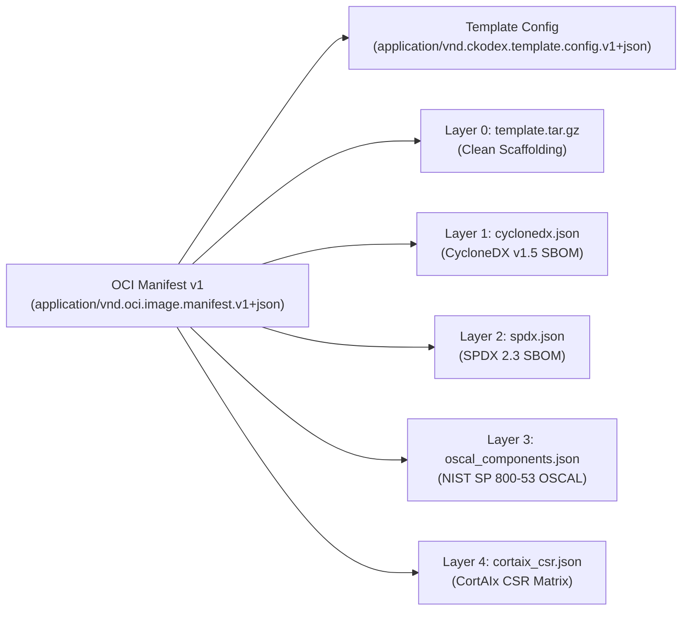

## 1. DevSecOps Principles (Top 1% Engineering)

Traditional CI/CD relies on brittle, un-testable bash scripts inside proprietary YAML runners. In this platform, **Dagger** is the primary programmable automation engine:
1. **Local-to-Cloud Identical Execution**: The exact same Dagger pipeline runs identically on local macOS workstations and remote CI runners.
2. **Containerized Hermetic Sandboxes**: Every build, test, and scan step runs inside isolated, cached OCI containers.
3. **Continuous Security Verification**: Security gates are built directly into the inner loop, not as an afterthought.

---

## 2. SSDLC Pipeline Architecture

```text
Source Code
    │
    ├─► [Lint & Format] ────► Ruff Python 3.12 (Strict Linter)
    │
    ├─► [Test Matrix] ──────► PyTest (Coverage & Contract Invariants)
    │
    ├─► [Security Scan]
    │       ├─► Gitleaks ─────► Secret Detection & Token Leak Prevention
    │       ├─► Syft ─────────► CycloneDX / SPDX SBOM Generation
    │       └─► Grype ────────► CVE Vulnerability Gate (Critical/High Severity Gating)
    │
    ├─► [Multi-Arch Build] ──► Build OCI Image for linux/amd64 & linux/arm64
    │
    └─► [Docs Build] ────────► Hugo Architecture & Ops Static Site Generation
```

---

## 3. Vulnerability Management & SBOM (Rule #39)

### Software Bill of Materials (SBOM) with Syft
Every build automatically generates a cryptographically hashed Software Bill of Materials (SBOM) using **Anchore Syft**:
- Formats: CycloneDX JSON and SPDX JSON.
- Content-Addressed: Hashed using SHA-256 and committed alongside build evidence receipts.

### Automated Vulnerability Gating with Grype
The generated SBOM is analyzed by **Anchore Grype**:
- Scans direct and transitive dependencies against NVD, GitHub Advisory Database, and OS feeds.
- Hard policy: Pipelines fail immediately on unmitigated `CRITICAL` severity CVEs unless an explicit, authority-approved Derogation is presented.

---

## 4. Multi-Platform OCI Container Builds

Modern AI workloads deploy across heterogeneous infrastructure:
- **`linux/arm64`**: Apple Silicon workstations, AWS Graviton3/4, Ampere Altra edge devices.
- **`linux/amd64`**: x86_64 servers with NVIDIA CUDA accelerators.

Dagger builds multi-platform container manifests:
```bash
dagger call build-multiplatform --source .
```
Resulting in an OCI image index pointing to architecture-specific digest layers.

---

## 5. Unified Command Runner (`justfile`)

The platform provides a modern, declarative `justfile` replacing ad-hoc shell scripts with self-documenting, repeatable recipes:

```bash
# List all operational recipes
just

# Inner-loop development & tests
just lint
just test
just test-fast

# Day-2 operations & preflight
just doctor
just reconcile
just conformance
just drift

# Container & Kubernetes deployments
just compose-up
just helmfile-apply env=local

# Security & Compliance
just sbom
just oscal
just csr-matrix
just airgap-pack
```

---

## 6. Containerized Orchestration (`docker-compose.yml`)

Local integration and developer environments run on `deploy/compose/docker-compose.yml`:
- **Ray Distributed Mesh**: Dedicated Head node with Dashboard (`:8265`, `:10001`) and autoscaling Worker containers.
- **MLflow Tracking Server**: Central experiment tracking, metrics, and artifact registry (`:5000`).
- **HashiCorp Vault**: Zero-trust secrets management with AppRole authentication (`:8200`).
- **Model Serving Gateway**: Low-latency FastAPI HTTP inference gateway (`:8080`).
- **Living Documentation Cockpit**: Nginx reverse proxy serving the Hugo static documentation and AIOps Cockpit (`:8088`).

---

## 7. Declarative Kubernetes Deployments (`helmfile.yaml`)

Production and staging deployments are managed via **Helmfile** and the `deploy/charts/ckodex-aiops` Helm chart:
- **Zero-Trust NetworkPolicy**: Closed by default (`default-deny-all`), permitting ingress/egress solely to explicitly authorized endpoints (`CFY-NET-ING`, `CFY-NET-EGR`).
- **Hardened Pod Security**: `readOnlyRootFilesystem: true`, `runAsNonRoot: true`, `allowPrivilegeEscalation: false`, all Linux capabilities dropped (`drop: ["ALL"]`).
- **Vault Agent Sidecar Injection**: Zero long-lived credentials stored in manifests or environment variables.

```bash
# Preview declarative differences across environments
helmfile --file deploy/helmfile.yaml --environment production diff

# Apply changes with automatic reconciliation
helmfile --file deploy/helmfile.yaml --environment production apply
```

---

## 8. CortAIx Factory CSR Traceability Matrix

The platform operationalizes the **107 CortAIx Factory Cybersecurity Requirements (CSR v1.1.0)** across FPR, TRR, and PRR gates:
- **Automated Matrix Generation**: `just csr-matrix` compiles JSON, CSV, and Markdown traceability reports under `data/08_reporting/compliance/`.
- **Release Gate Validation**:
  - `FPR-TRAC`: Traceability continuously updated and hashed.
  - `TRR-PLAN` & `TRR-DOCU`: Comprehensive 63+ test verification matrix and Hugo living docs.
  - `PRR-REL-SBOM`: Dual-format CycloneDX and SPDX content-addressed dependency records.
  - `PRR-REL-SIGN`: Cryptographic In-toto SLSA provenance statements.

---

## 9. NIST SP 800-53 OSCAL Component Definitions

Machine-verifiable security postures are emitted as **OSCAL 1.2** documents (`just oscal`):
- Five architectural components mapped: `ckodex-kernel`, `ckodex-secrets-engine`, `dagger-ssdlc-harness`, `ray-distributed-mesh`, and `autonomic-reconciler`.
- Automated cross-referencing between NIST SP 800-53 controls (`AC-3`, `AU-2`, `SC-13`, `SA-11`, `CM-8`, `SC-28`, `SI-7`) and CortAIx CSR control identifiers.

---

## 10. OCI Artifact Packaging & Distribution (OCI Spec v1.1.0)

In compliance with **CKODEX Rule #39 (Supply-Chain Identity is Content-Addressed)** and **Rule #40 (Air-Gap is a Design Property)**, the workspace template is packaged as an immutable, content-addressed OCI Artifact using standard OCI Image Layout (`application/vnd.oci.image.manifest.v1+json`).

### Multi-Layer Artifact Architecture



### Local Packaging & Inspection
```bash
# Package template into standard OCI Image Layout
just oci-pack version=1.0.0 tag=latest

# Inspect layout layers, config, and manifest without extracting
just oci-inspect

# Unpack template to scaffold a new workspace
just oci-unpack /path/to/new-aiops-project
```

### Enterprise Registry Distribution (ORAS & Sigstore Cosign)
```bash
# Push layout to GitHub Packages / ECR / Harbor using CNCF ORAS
oras copy --from-oci-layout dist/oci-template:latest ghcr.io/cfyd-ai/ckodex-aiops-template:v1.0.0

# Sign OCI Artifact with Sigstore Cosign
cosign sign --yes ghcr.io/cfyd-ai/ckodex-aiops-template:v1.0.0

# Attach SLSA Provenance as an OCI Referrer
cosign attest --yes --predicate data/08_reporting/attestations/statement.intoto.jsonl \
  --type https://slsa.dev/provenance/v1 ghcr.io/cfyd-ai/ckodex-aiops-template:v1.0.0

# Consumer instantiation from registry
oras pull ghcr.io/cfyd-ai/ckodex-aiops-template:v1.0.0 --output ./my-new-project
```

