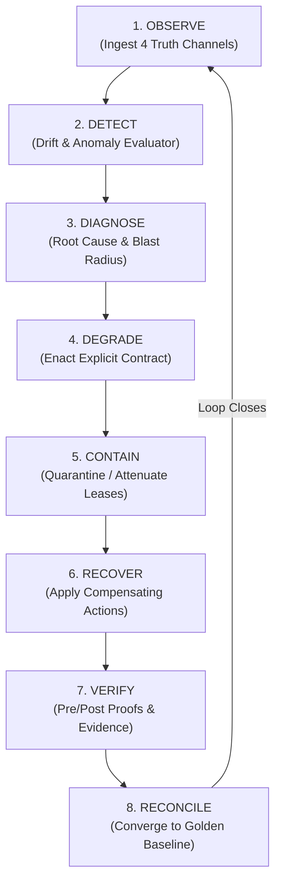

# The Canonical Day-2 Control Loop

> **Constitutional Rule #27:** A feature is incomplete if it can be deployed but cannot be observed, diagnosed, changed, degraded, contained, quarantined, recovered, replayed, reconciled, rolled back, upgraded, or offboarded.  
> **Constitutional Rule #28:** Canonical Day-2 Control Loop: `OBSERVE -> DETECT -> DIAGNOSE -> DEGRADE -> CONTAIN -> RECOVER -> VERIFY -> RECONCILE`.  
> **Constitutional Rule #35:** Long-lived systems converge through: `Desired State <-> Reconciler <-> Observed State`.

---

## 1. Day-2 by Default

In standard DevOps, Day-1 (deployment and configuration) receives 90% of engineering attention, while Day-2 operations (incident management, failover, recovery, drift reconciliation) are delegated to runbooks and human on-call fatigue.

In **CKODEX GAL 1**, Day-2 capabilities are first-class architectural primitives implemented directly in code. A capability cannot be admitted into production unless its Day-2 degradation, containment, recovery, and reconciliation contracts are fully verified.

---

## 2. The 8-Stage Canonical Control Loop



### 1. OBSERVE
Continuous ingestion of the Four Truth Channels (Telemetry, Execution, Decision, and Evidence). The observer runs with bounded buffers and zero-loss guarantees for cryptographic receipts.

### 2. DETECT
Compares incoming observations against declared golden baselines and active capability leases. Detects:
- Metric anomalies and SLA breaches
- Vector state divergences
- Cross-channel decoherences
- Unauthorized configuration mutations

### 3. DIAGNOSE
The `ExplanationEngine` analyzes the causal graph to determine:
- **Exact root cause:** Is it a code regression, hardware failure, upstream outage, or hostile intrusion?
- **Blast radius:** Which namespaces, tenants, and downstream services are affected?
- **Contamination analysis:** Did tainted state leak into persistent stores?

### 4. DEGRADE
Rather than suffering an uncontrolled crash or cascading timeout failure, the component immediately transitions into an **Explicit Degraded Mode** with a mathematically bounded contract:
- *Local-only / Offline fallback mode*
- *Read-only caching mode (blocked writes)*
- *Fast heuristic scoring instead of heavy neural inference*

### 5. CONTAIN
Freezes or revokes the subject's authority:
- Capability leases are attenuated or revoked.
- Network egress is restricted to quarantine isolation subnets.
- State mutation is frozen while forensic flight-recorder evidence is preserved.

### 6. RECOVER
Executes bounded, deterministic recovery procedures:
- Resumes execution from the last safe immutable checkpoint.
- Replays input streams with duplicate-suppression fencing.
- Applies automated compensation routines (e.g., reverting schema migration).

### 7. VERIFY
Establishes pre-conditions and post-conditions before promoting recovered services:
- Verifies artifact signatures and storage integrity.
- Runs synthetic canary requests through the pure semantic kernel.
- Validates that no lingering anti-invariants exist.

### 8. RECONCILE
The `Day2Reconciler` brings the runtime state into mathematical alignment with the declared desired state:
- Computes minimal mutation delta.
- Emits cryptographic receipts recording the convergence.
- Closes the loop and restores the system to `NORMAL` operational status.

---

## 3. Explicit Runtime Operational Modes

Constitutional Rule #29 mandates that operational modes are explicit enums, not hidden boolean flags:

```text
    +-------------------------------------------------------------+
    |                    EXPLICIT RUNTIME MODES                   |
    +---------------+---------------------------------------------+
    | NORMAL        | All capabilities active, zero constraints.  |
    +---------------+---------------------------------------------+
    | DEGRADED      | Operating under explicit residual contract. |
    +---------------+---------------------------------------------+
    | SAFE_HOLD     | Execution paused; awaiting human review.    |
    +---------------+---------------------------------------------+
    | QUARANTINED   | Isolated; authority revoked; evidence held. |
    +---------------+---------------------------------------------+
    | RECOVERING    | Replaying from checkpoint; fences active.   |
    +---------------+---------------------------------------------+
    | FAILED        | Non-recoverable terminal state; requires    |
    |               | manual administrative intervention.         |
    +---------------+---------------------------------------------+
```

---

## 4. Contractual Degradation vs. Silent Failure

In fragile architectures, degradation is accidental: timeouts build up, memory leaks cause Out-Of-Memory kills, and users receive generic 500 errors.

In CKODEX, every degraded mode is governed by an explicit `DegradationContract`:
```python
contract = DegradationContract(
    mode=RuntimeMode.DEGRADED,
    trigger="upstream_latency > 250ms OR network_decoherence",
    residual_capabilities=["cached_read", "offline_validation"],
    prohibited_capabilities=["ledger_mutation", "authority_promotion"],
    freshness_tolerance_seconds=1800,
    max_exposure_duration_seconds=3600,
    recovery_criteria="upstream_latency < 50ms FOR 5m",
)
```

Never silently weaken a security, integrity, or scientific invariant merely to preserve availability. If a trade-off is unavoidable, the component enters `SAFE_HOLD` and leaves the final determination to authorized human operators.
