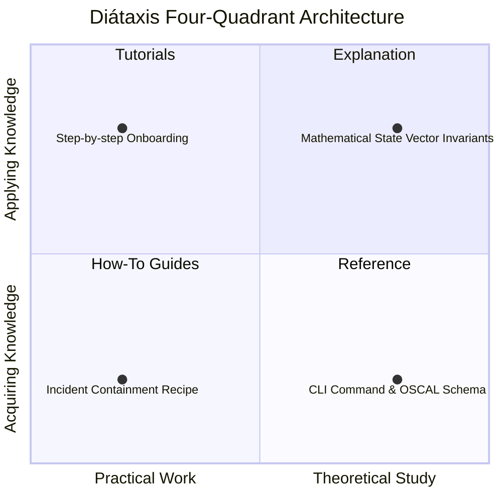

# Why Diátaxis, Hugo, and Dagger: Hermetic Documentation as Code in Regulated AI

In mission-critical, regulated AI systems (governed under **CKODEX Constitutional Standard GAL 1**), documentation is not an afterthought or marketing collateral. It is an **executable, authoritative evidence channel** that explains system behavior to operators, auditors, and autonomous agents.

---

## 1. The Problem of Cognitive Collapse in Technical Documentation

Traditional software documentation often suffers from *cognitive collapse*:
- A single README file attempts to be an onboarding guide, a quickstart, an API reference, and a philosophical manifesto simultaneously.
- Practitioners seeking an urgent recovery recipe (`how-to`) are forced to read through introductory tutorials.
- Auditors seeking formal mathematical guarantees (`explanation`) or exact control schemas (`reference`) encounter simplified beginner explanations.

### The Diátaxis Solution
The Diátaxis framework resolves this tension by strictly separating documentation along two orthogonal axes:

$$\text{Orientation} \in \{\text{Learning, Problem, Information, Understanding}\}$$
$$\text{Activity} \in \{\text{Practical, Theoretical}\}$$

By enforcing this four-quadrant separation, an incident response operator can instantly locate quarantine recipes in `how-to/` without wading through architectural essays in `explanation/`.

---

## 2. Why Hugo: Sub-50ms Compilation and Zero Runtime Surface

For living documentation, engine choice directly impacts developer experience and air-gap sovereign portability:

1. **Sub-50ms Incremental Builds**: Hugo compiles hundreds of pages and complex Mermaid diagram layouts in under 40 milliseconds. This near-instant feedback loop ensures developers actually update documentation alongside code changes.
2. **Zero Runtime Dependencies**: The compiled output is purely static HTML, CSS, and SVG. It requires no Node.js runtime, no dynamic database, and no server-side JavaScript execution.
3. **Dual Distribution**:
   - **Online**: Deployed to GitHub Pages via automated CI/CD.
   - **Offline / Air-Gap**: Embedded directly into the sovereign distribution bundle (`dist/ckodex-aiops-*-airgap.tar.gz`) and served locally by a zero-dependency Nginx container (`deploy/compose/docker-compose.yml`).

---

## 3. Why Dagger: Hermetic Documentation as Code

Most documentation pipelines rely on complex, ad-hoc shell scripts embedded directly in GitHub Actions YAML files. In CKODEX, this is an architectural anti-pattern violating **Rule #9 (Transport Only Transports)**.

GitHub Actions is a transport mechanism; it should not own build logic or environment definitions.

### The Dagger Advantage:
- **Hermetic Containerization**: Hugo runs inside an immutable, containerized Ubuntu environment (`klakegg/hugo:ext-ubuntu`). Whether compiled on macOS, Linux, or a GitHub Actions runner, the build output is byte-for-byte deterministic.
- **Local / Remote Parity**: Developers can execute `dagger call -m ./ci build-docs --source . export --path docs/public` locally and get the identical result that CI produces on GitHub Pages.
- **Content-Addressed Caching**: Dagger automatically hashes source trees, ensuring documentation is re-compiled only when markdown files or templates change.

---

## 4. Operational Alignment with CKODEX Constitutional Rules

- **Rule #37 (Deep Observability Must Support Explanation)**: When `ckodex-aiops explain` answers diagnostic questions, the operator can cross-reference the exact rationale documented under `docs/content/explanation/`.
- **Rule #40 (Air-Gap is a Design Property)**: The entire documentation site can be compiled, verified, and browsed in an air-gapped SCIF without internet access.
- **Rule #41 (Invisible Excellence)**: Complex multi-platform builds and GitHub Pages deployments are abstracted behind clean, typed interfaces (`just docs-pages-build` and `ci/src/ckodex_cicd/main.py`).
