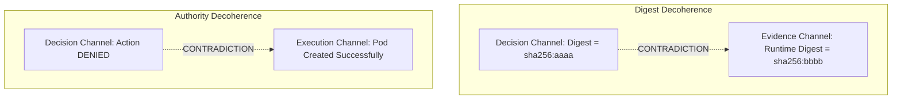

# The Four Truth Channels and State Coherence

> **Constitutional Rule #12:** Do not collapse all observability into logs. Maintain four distinct truth channels: Telemetry, Execution, Decision, and Evidence. They may correlate, but they MUST NOT be treated as interchangeable.  
> **Constitutional Rule #17:** Coherence is independent of valence. Decoherence means multiple representations of reality no longer form one trustworthy state.

---

## 1. Why Single-Channel Observability Fails

Conventional observability platforms consolidate logs, metrics, and distributed spans into a single time-series or search index. While useful for basic performance troubleshooting, this approach fails in mission-critical and governed autonomous operations:

- **Logs are Not Evidence:** A log entry `INFO: policy check passed` can be spoofed, dropped by sampling, altered in flight, or emitted by an unauthenticated thread. It lacks cryptographic proof of identity, policy digest, or pre-execution capability verification.
- **Metrics are Blind to Intent:** High CPU or queue depth (telemetry) cannot explain *why* an autonomous agent decided to scale down or fail over (decision trace).
- **Execution Paths Diverge from Decisions:** A decision engine may authorize action $A$, but due to race conditions or software bugs, the runtime executes action $B$.

To guarantee complete auditability, explainability, and safety, CKODEX defines **Four Distinct Truth Channels**.

---

## 2. The Four Truth Channels Defined

```
+-------------------------------------------------------------------------+
|                         FOUR TRUTH CHANNELS                             |
+-------------------+-----------------------------------------------------+
| 1. Telemetry      | "What did the machinery do?"                        |
|    Trace          | CPU, GPU, memory, latency, IOPS, queue depths,      |
|                   | network traffic, packet drops, retries.             |
+-------------------+-----------------------------------------------------+
| 2. Execution      | "Which technical path was actually taken?"          |
|    Trace          | Function call trees, branch selections, container   |
|                   | lifecycles, syscall exits, process spawned.         |
+-------------------+-----------------------------------------------------+
| 3. Decision       | "On which facts, policies, and rules was this based?"|
|    Trace          | Policy digests, rule evaluations, admission inputs, |
|                   | vector state snapshots, derogation scopes.          |
+-------------------+-----------------------------------------------------+
| 4. Evidence       | "What can we cryptographically prove afterward?"    |
|    Trace          | Signed receipts, content digests (SHA-256), in-toto |
|                   | attestations, Cosign signatures, Rekor UUIDs.       |
+-------------------+-----------------------------------------------------+
```

### Channel 1: Telemetry Trace
Answers technical performance and physical resource questions:
- *Latency percentiles (p50, p95, p99)*
- *Memory saturation and GC pause durations*
- *Vector database query throughput*

### Channel 2: Execution Trace
Answers technical control flow questions:
- *Did the executor take the Fast Path or the Fallback Remediation branch?*
- *Which specific container image and binary version executed the step?*

### Channel 3: Decision Trace
Answers governance and policy justification questions:
- *Which exact OPA/Rego or pure Python policy bundle was active?*
- *What was the vector state $S(e,t)$ at the precise millisecond of admission?*
- *Was an active derogation lease attached to override invariant check #4?*

### Channel 4: Evidence Trace
Answers forensic, legal, and compliance questions:
- *Who signed the capability lease?*
- *Does the artifact digest on disk match the immutable digest recorded at build time?*
- *Is the receipt recorded in an immutable append-only ledger?*

---

## 3. Cross-Channel Decoherence

Decoherence occurs when two or more truth channels contradict each other. Decoherence is not merely a component failure; it is an immediate threat to system integrity.

### Canonical Decoherence Patterns:



1. **Digest Decoherence:**  
   The Decision channel authorized deployment of artifact `sha256:7f3a...`, but the Evidence channel recorded runtime execution of `sha256:1b2c...`.
2. **Authority / Execution Decoherence:**  
   The Decision channel emitted a `DENY` disposition, but the Execution channel shows that the container was launched and performed network egress.
3. **Telemetry / Evidence Decoherence:**  
   The Telemetry channel reports that an inference worker was idle, but the Evidence channel records 500 completed signed transactions during that window.

---

## 4. The Autonomic Response to Decoherence

When the CKODEX reconciler or monitor detects cross-channel decoherence:

1. **Immediate Safe-Hold or Quarantine:** The affected workload or agent capability lease is immediately frozen or revoked.
2. **Evidence Preservation:** Flight recorder buffers across all four channels are dumped to immutable storage (`quarantine-evidence/`).
3. **Decoherence Classification:** The `ExplanationEngine` computes the exact channel divergence vectors.
4. **Reconciliation or Human Escalation:** If automated safe rollback is defined, the system reverts to the last coherent baseline; otherwise, an alert with full cryptographic receipts is dispatched to operations.

By maintaining strict boundaries between these four channels, CKODEX ensures that operations can always reconstruct what happened, why it happened, and prove it to external auditors.
