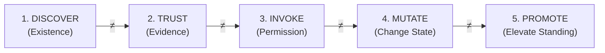
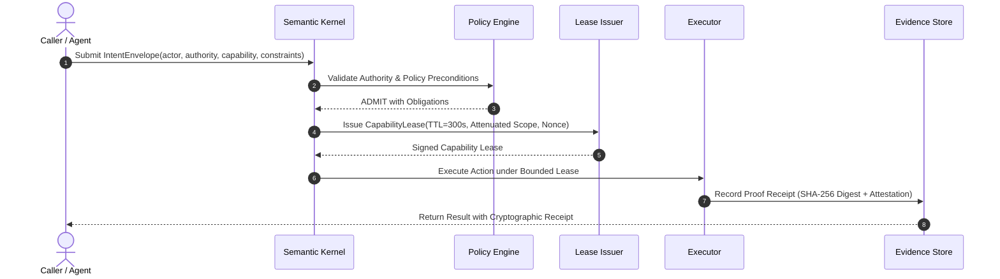

# Zero-Trust Authority & Capability Attenuation

> **Constitutional Rule #2:** Authority precedes everything. CKODEX objects are authority-born. Agents, models, tools, sandboxes, workloads, and services are subjects of authority, not sources of authority.  
> **Constitutional Rule #3:** Do not collapse distinct governance operations: `DISCOVER != TRUST != INVOKE != MUTATE != PROMOTE`.  
> **Constitutional Rule #25:** Zero Trust + Capability Leases. Meaningful execution boundaries must explicitly determine authenticated identity, effective authority, delegation, resource, constraints, and expiry. Never trust ambient location.

---

## 1. The Myth of Ambient Trust and Static Credentials

Traditional infrastructure systems grant ambient privileges based on network proximity or static role assignments:
- *"The service is running inside the Kubernetes cluster on a private VPC, so it can talk to the database."*
- *"The AI agent has a standing AWS IAM role with `s3:*` permissions."*
- *"The microservice authenticated via mTLS, so its mutations are authorized."*

In autonomous AI systems and high-assurance operations, ambient trust is catastrophic. A compromised agent, a prompt injection vulnerability, or an unintended recursion can weaponize standing credentials against enterprise infrastructure.

---

## 2. The Hierarchical Authority Tree

In CKODEX, every governed object must trace its lineage through an explicit standing-authority path:

```text
Root Fabric (Enterprise Sovereign Root)
└── Tenant (Organizational Boundary)
    └── Namespace (Logical Domain)
        └── Workspace (Collaborative Context)
            └── Plane (Control, Data, or Observation Plane)
                └── Environment (Production, Staging, Recovery)
                    └── Project (Discrete Mission / Initiative)
                        └── Resource (Model, Store, Pipeline, Node)
```

### Invariants of the Authority Hierarchy:
1. **No Orphaned Objects:** No workload, agent, pipeline, or database record can exist without a parent node in the authority tree.
2. **Strict Attenuation:** A delegated child capability **MUST NOT** exceed its parent authority in scope, duration, or mutation permissions.
3. **Revocation Cascades:** If authority is revoked or quarantined at the Namespace level, all subordinate Workspaces, Environments, and Resources are instantly halted.

---

## 3. Dissecting Distinct Governance Transitions

Constitutional Rule #3 strictly prohibits inferring later privileges from earlier validations:



- **DISCOVER $\ne$ TRUST:** Finding an MCP tool or external API endpoint does not mean it is trustworthy or signed.
- **TRUST $\ne$ INVOKE:** Verifying an artifact's cryptographic signature does not grant permission to execute it.
- **INVOKE $\ne$ MUTATE:** Permission to query a model or read a dataset does not grant authority to modify persistent ledgers.
- **MUTATE $\ne$ PROMOTE:** Writing a valid test result or canary build does not promote that code to the production golden baseline.

Each transition requires independent, explicit authorization, validation, and cryptographic evidence generation.

---

## 4. Intent as the Unit of Work

Execution in CKODEX never begins with a raw shell command, an arbitrary REST call, or an unconstrained LLM prompt. Every action begins with an **Intent Envelope**:



---

## 5. Ephemeral Capability Leases

Standing privileges are replaced by time-bounded, cryptographically signed `CapabilityLease` tokens:

```python
lease = CapabilityLease(
    lease_id="lease-sec-88412",
    subject_id="agent://cortaix/reconciler-worker-04",
    parent_authority="tenant://cortaix/ns/prod/plane/control",
    allowed_actions=["reconcile:read", "reconcile:apply_remediation"],
    denied_actions=["authority:delegate", "ledger:purge"],
    resource_scope="urn:ckodex:service:inference-cluster-01",
    issued_at=datetime(2026, 9, 19, 19, 0, 0, tzinfo=timezone.utc),
    expires_at=datetime(2026, 9, 19, 19, 5, 0, tzinfo=timezone.utc),  # 5-minute TTL
    signature="ed25519:3a8f...",
)
```

### Core Security Guarantees:
- **Zero Ambient Authority:** If an executor attempts an action without presenting an active, unexpired lease signed by an authorized parent, the Semantic Kernel immediately throws an `AuthorityException`.
- **Instant Revocation:** Leases can be revoked before their natural expiry via the quarantine subsystem, causing ongoing executions to terminate at their next synchronous checkpoint.
- **Auditable Lineage:** The lease ID and parent authority path are permanently recorded in the Evidence Trace of every mutation.
