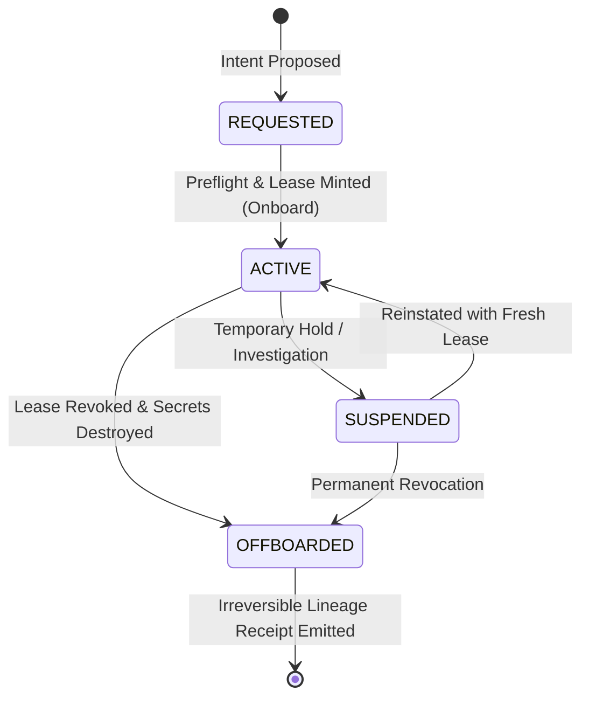

## 1. Subject Lifecycle Architecture (GAL 1)

In compliance with **CKODEX Rule #2 (Authority Precedes Everything)** and **Rule #25 (Zero Trust + Capability Leases)**, all human operators, autonomous AI agents, tenants, and compute nodes must be explicitly onboarded before executing capabilities.



---

## 2. Current Lifecycle Metrics

- **Total Governed Subjects**: `3`
- **Active**: `2` (with valid unexpired leases)
- **Suspended**: `0`
- **Offboarded / Revoked**: `1`

---

## 3. Active Governed Subjects

| Subject ID | Type | Role | Authority Path | Capabilities | Lease Expiration | Status |
| :--- | :---: | :--- | :--- | :--- | :--- | :---: |
| `engineer-lead` | `OPERATOR` | **admin** | `urn:ckodex:cfyd:aiops:development:ckodex-aiops` | `*` | 2026-09-20 01:31 UTC | 🟢 ACTIVE |
| `agent-inference-prod` | `AGENT` | **inference-server** | `urn:ckodex:cfyd:aiops:development:ckodex-aiops` | `model:read, inference:execute` | 2026-09-20 01:31 UTC | 🟢 ACTIVE |

---

## 4. Offboarded & Revoked Ledger

| Subject ID | Type | Role | Offboarded At | Reason | Offboarding Receipt |
| :--- | :---: | :--- | :--- | :--- | :--- |
| `node-mps-worker-1` | `COMPUTE_NODE` | **ray-worker** | 2026-09-19T01:31:28.792443+00:00 | scheduled maintenance rotation | `rcpt_lifecycle_288453e7c182` |

---

## 5. Self-Documenting Operational Procedures

```bash
# Onboard a new operator
just onboard-operator id="engineer-alice" role="mlops"

# Onboard an autonomous AI agent
just onboard-agent id="agent-planner" role="pipeline-executor"

# Offboard with immediate lease revocation and secret wipe
just offboard id="engineer-alice" reason="project rotation"

# View full machine-verifiable audit ledger
just lifecycle-audit
```