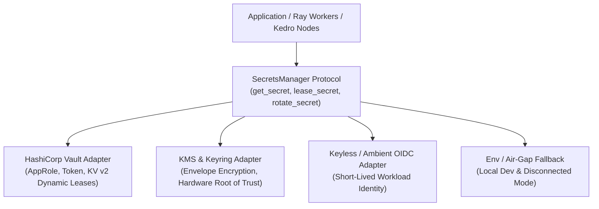

## 1. Zero-Trust Secrets Management (Rule #25)

Standing privilege and static secrets stored in plain text environment variables are prohibited in production.

All secrets access must be:
```text
EXPLICIT • SCOPED • ATTENUATED • TIME-BOUNDED • REVOCABLE • OBSERVABLE • PROVABLE
```

---

## 2. Secrets Provider Abstraction

The platform implements a unified `SecretsManager` port & adapter interface:



### 1. HashiCorp Vault Adapter
- Connects to HashiCorp Vault via AppRole, Kubernetes Service Account token, or client certificates.
- Requests dynamic leases with automatic TTL management and periodic renewal.
- Automatically revokes leases upon node completion or pipeline exit.

### 2. Envelope Encryption & KMS / Keyrings
- Secret payloads are encrypted under a local Data Encryption Key (DEK).
- The DEK is encrypted under a Key Encryption Key (KEK) managed by cloud KMS or OS-native keyrings (macOS Keychain, Linux SecretService).

### 3. Keyless / Ambient Workload Identity
- Leverages short-lived OIDC tokens (e.g. GitHub Actions OIDC, Kubernetes ServiceAccount tokens) to vend ephemeral credentials on-demand, eliminating static API keys.

---

## 3. Memory Safety & Secret Redaction

- Secret values are wrapped in a protected `SecretValue` container that prevents accidental leaking into string representations, logs, telemetry, decision traces, or error tracebacks:
  ```python
  repr(secret) == "SecretValue(***REDACTED***)"
  str(secret) == "***REDACTED***"
  ```
- Memory is scrubbed or wiped upon lease release.

---

## 4. Supply-Chain Attestation & Compliance (Rule #39)

### In-toto v1.0 & SLSA Provenance v1.0
Every model checkpoint is paired with a cryptographic In-toto statement:
- Content-addresses model artifacts via SHA-256.
- Documents build definition, external hyperparameters, and resolved dependencies.
- Embeds execution lease receipts proving build authorization.

### NIST SP 800-53 Rev 5 OSCAL
The platform generates machine-verifiable OSCAL component definitions mapping technical implementations directly to federal assurance controls:
- **AC-3**: Access Enforcement via Zero-Trust capability leases.
- **AU-2**: 4-Channel Observability and immutable execution receipts.
- **SC-13**: Cryptographic Protection via Safetensors and envelope KMS encryption.
- **SI-7**: Software and Information Integrity via SLSA provenance, Syft SBOMs, and Grype gating.
