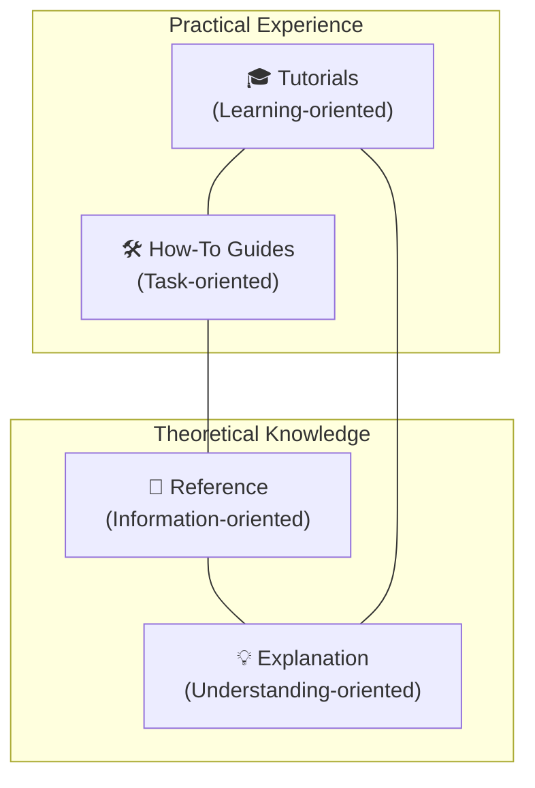

# Authoring Living Documentation with Diátaxis & Hugo

In this tutorial, you will learn how to write, verify, and publish architectural and operational documentation for the CKODEX platform. By the end of this tutorial, you will have authored a documentation page, tested it with the local Hugo live-reload server, validated it hermetically with Dagger, and verified its deployment pipeline for GitHub Pages.

---

## What is Diátaxis?

The **Diátaxis framework** classifies documentation into four distinct quadrants based on user needs:



1. **Tutorials (Learning-oriented)**: Takes the reader by the hand through a series of steps to achieve a learning goal.
2. **How-To Guides (Problem-oriented)**: Leads the reader through the steps required to solve a real-world problem.
3. **Reference (Information-oriented)**: Technical descriptions of the machinery and how to operate it.
4. **Explanation (Understanding-oriented)**: Discursive treatment of concepts, design rationale, and context.

---

## Step 1: Choose the Target Quadrant

Ask yourself what the user is trying to accomplish:
- If teaching a newcomer the basics: place under `docs/content/tutorials/`.
- If solving a specific operational task: place under `docs/content/how-to/`.
- If providing APIs, tables, flags, or schemas: place under `docs/content/reference/`.
- If explaining architectural decisions or mathematical proofs: place under `docs/content/explanation/`.

---

## Step 2: Create the Markdown Document

Create a new file under the chosen quadrant, for example `docs/content/tutorials/my-first-guide.md`:

```markdown
---
title: "Monitoring Real-Time Sensor Streams"
description: "Step-by-step tutorial for attaching Ray streaming co-actors to robotics telemetry."
weight: 40
---

# Monitoring Real-Time Sensor Streams

## Learning Goal
By completing this lesson, you will connect a streaming sensor source to the Lance storage mesh.

## Prerequisites
- A running local cluster (`just compose-up`)
- Activated Python environment (`source .venv/bin/activate`)

## Step-by-Step Instructions
...
```

### Frontmatter Conventions
- `title`: Concise, active title.
- `description`: Single-sentence summary displayed in section indexes.
- `weight`: Integer determining position in navigation menus (lower appears first).

---

## Step 3: Test Locally with Hugo Live Server

Start the Hugo development server:

```bash
just docs-serve
# or: hugo server --source docs -D
```

Open your browser at `http://localhost:1313`. Hugo will live-reload your page in sub-50 milliseconds whenever you save edits.

Verify:
- Navigation links correctly render in the sidebar.
- Mermaid diagrams render cleanly without syntax warnings.
- Tables and code blocks format with high readability.

---

## Step 4: Hermetic Build Verification via Dagger

Before opening a pull request, compile the documentation inside an isolated container using the Dagger Python SDK module:

```bash
just dagger-docs
# or: dagger call -m ./ci build-docs --source . export --path docs/public
```

This ensures:
- The site compiles with zero dependencies on your host machine.
- All template assets, styles, and scripts pass strict syntax checks.
- Clean destination directory output in `docs/public/`.

---

## Step 5: Automatic Publishing to GitHub Pages

Once your pull request merges into `main`:
1. The `.github/workflows/pages.yml` workflow triggers.
2. Dagger compiles the Hugo site with the repository's GitHub Pages `baseURL`:
   ```bash
   dagger call -m ./ci build-docs --source . --base-url "https://ckodex-labs.github.io/ckx-ai-project-template/" export --path ./public
   ```
3. GitHub Pages securely deploys the content to the live public URL.

You have now mastered the end-to-end documentation workflow.
